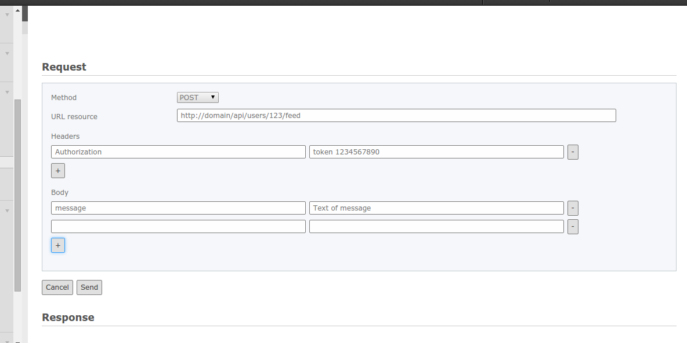
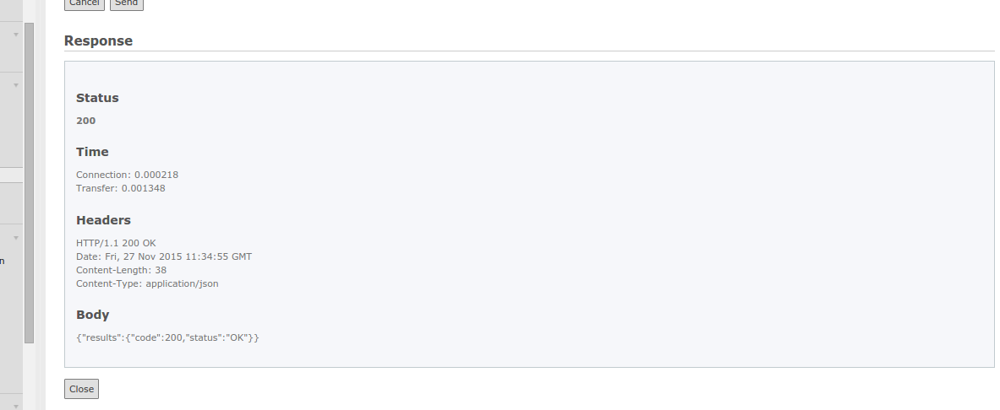
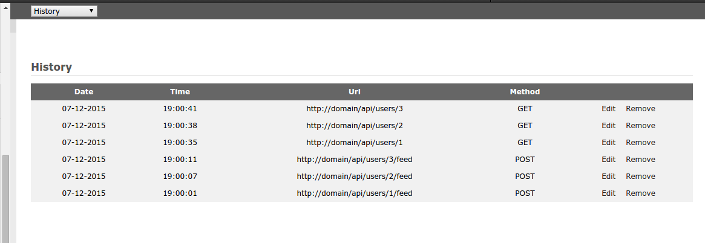

.. ==================================================
.. FOR YOUR INFORMATION
.. --------------------------------------------------
.. -*- coding: utf-8 -*- with BOM.

.. include:: ../Includes.txt

Users manual
============

REST Request
^^^^^^^^^^^^

The Backend module Rest client UI, in "REST request" section, will show the form to send the requests.

| 
| The fields are: Method, URL resource, Headers and Body.
| Once you have prepared the request, then click the Send button.
| 

| 
| The response will consist of many information: the HTTP status code, the elapsed time, the headers, and the body.
|

History
^^^^^^^^^^^^

| If you have enabled in configuration, the "History" section will show the history of requests.
| You can edit or remove the requests.
|

